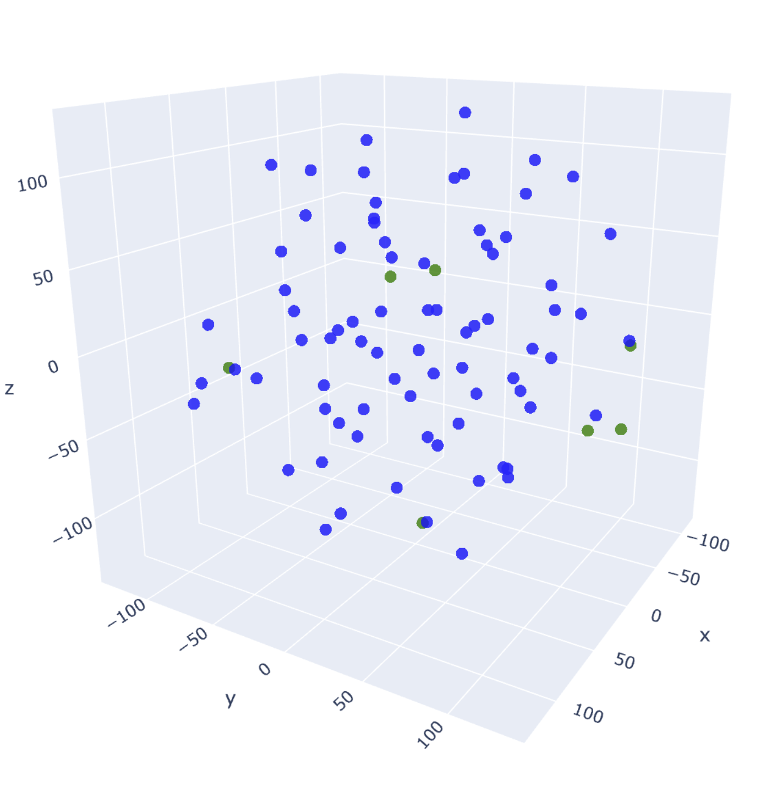
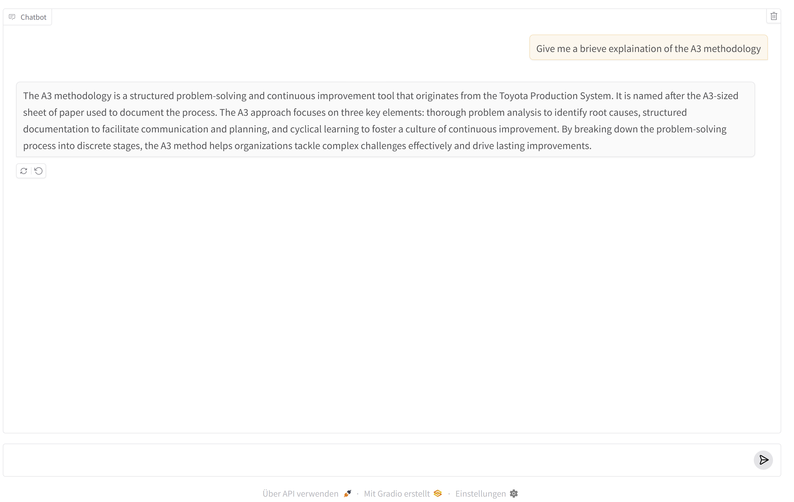

# LeanBot – AI Learning Assistant for Lean & PSS**

## Purpose  
Develop a small AI-powered assistant to help production teams learn Lean methodologies and the Production System Standard (PSS) in a fun, interactive way—while testing new AI capabilities in a real-world setting.

## What It Does  
- Uses a **Large Language Model with RAG** (Retrieval-Augmented Generation) to provide accurate, contextual answers.  
- Delivers **on-demand guidance** on Lean and PSS directly on the shop floor.  
- Includes **microlearning modules** and **gamified challenges** to keep learning engaging.

## Goals  
- Educate production staff in Lean and PSS concepts.  
- Explore and validate the use of AI in a manufacturing environment.  
- Collect insights to inform future development and scaling.

## Pilot Scope  
- Run at one selected production site.  
- Train AI using standard Lean/PSS materials and site-specific examples.  
- Measure success through engagement, learning improvement, and user feedback.

## Technology  
- **LLM + RAG**  
- Curated **Lean/PSS knowledge base**

## Why It Matters  
This project explores how AI can support **continuous learning** and **lean transformation**—making expert knowledge more accessible, interactive, and actionable for everyone on the shop floor.

# Set Up
- clone the repo
- create a .env file with OPENAI_API_KEY=YOURKEY
- create environment: conda env create --name envname --file=environments.yml
- activate environment: conda activate rag-env
- start jupyter notebook from terminal: jupyter lab
- execute code step by step

# Output

- The knowledge data base is vectorized: 

- Chat Bot Interface with Gradio is developed to interact with LLM 
